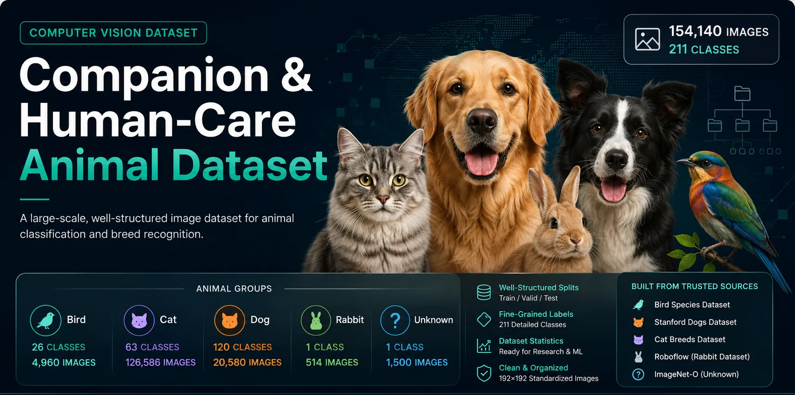

# Companion & Human-Care Animal Dataset

A large-scale, multi-class animal image classification dataset designed for **animal recognition, fine-grained breed/species classification, and computer vision research**.

The dataset contains **154,140 images across 211 classes**, covering dogs, cats, birds, rabbits, and an `unknown` category for unrelated images.

All images are standardized to **192×192 pixels** and organized into training, validation, and test splits.

## Dataset Overview

| Category  | Classes |      Images |
| --------- | ------: | ----------: |
| 🐦 Birds  |      26 |       4,960 |
| 🐈 Cats   |      63 |     126,586 |
| 🐕 Dogs   |     120 |      20,580 |
| 🐇 Rabbit |       1 |         514 |
| ❓ Unknown |       1 |       1,500 |
| **Total** | **211** | **154,140** |

The dataset is a composite collection assembled and standardized from multiple publicly available datasets for animal classification and recognition.

## Dataset

The complete image dataset is hosted on Hugging Face:

**Hugging Face Dataset:**
https://huggingface.co/datasets/Pezhvak98/companion-human-care-animal-dataset

The GitHub repository contains only the dataset metadata and does **not** store the image files.

## Repository Contents

```text
.
├── classes.json
├── dataset_metadata.json
├── dataset_stats.json
├── splits.csv
└── README.md
```

### `classes.json`

Contains the dataset class definitions and class-to-index mappings used by the classification dataset.

### `dataset_metadata.json`

Contains general dataset metadata, including dataset structure, categories, image specifications, and source information.

### `dataset_stats.json`

Contains dataset statistics such as:

* Total number of images
* Number of classes
* Images per animal group
* Images per split
* Class distribution
* Minimum, maximum, and average class sizes

### `splits.csv`

Contains per-image split metadata, including the image path, class information, dataset split, and integrity information.

## Dataset Structure

The image dataset on Hugging Face follows this structure:

```text
dataset/
├── train/
│   ├── bird_*/
│   ├── cat_*/
│   ├── dog_*/
│   ├── rabbit/
│   └── unknown/
│
├── valid/
│   └── ...
│
└── test/
    └── ...
```

## Source Datasets

The dataset was constructed from several existing public datasets, including:

* **Stanford Dogs Dataset**
* **Cat Breeds Dataset**
* **Bird Species Dataset**
* **Roboflow rabbit dataset**
* **ImageNet-O** for the `unknown` category

The original images remain subject to the terms and licenses of their respective source datasets.

## Intended Use

This dataset can be used for:

* Animal image classification
* Fine-grained breed/species recognition
* Transfer learning
* Computer vision research
* Dataset benchmarking
* Lightweight image classification models
* Unknown / negative-class experiments

## License

This is a **multi-source composite dataset**. The repository uses `Other` as its overall license designation because the underlying images originate from different datasets with their own licensing terms.

Users should review the license and usage conditions of the original source datasets before using the images, particularly for commercial redistribution.
